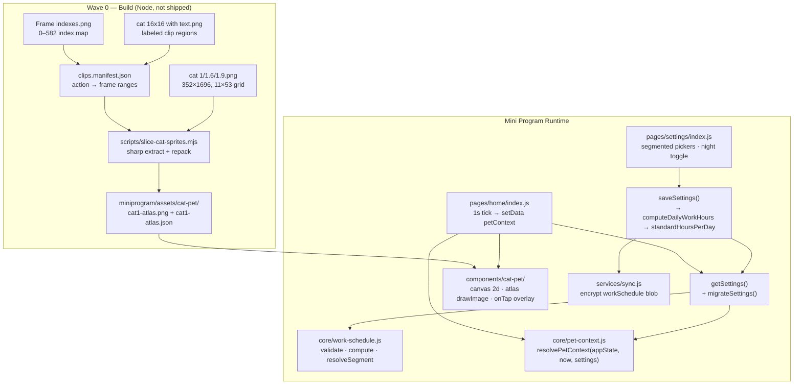

# Phase XSB-07: Pet Companion — Research

**Researched:** 2026-06-23  
**Domain:** WeChat mini program canvas 2d sprite animation + segmented work schedule FSM  
**Confidence:** HIGH

## Summary

Phase 7 adds two tightly coupled capabilities: (1) a **segmented work schedule** in settings that derives `standardHoursPerDay`, and (2) a **contextual pixel cat** on the home screen driven by `appState` + schedule + wall clock. The codebase already has the right integration seams — pure `core/` modules, thin pages, `getSettings()`/`saveSettings()`, canvas 2d in `share-card`, and native `picker mode="time"` in `record` — so this phase extends established patterns rather than introducing new architecture.

**Sprite assets are verified on disk.** All three unlabeled sheets (`cat 1.png`, `cat 1.6.png`, `cat 1.9.png`) and the reference overlay (`Frame indexes.png`) are **352×1696 px** — an **11-column × 53-row grid at 32 px cell pitch** (583 frames, indexes 0–582). The labeled reference (`cat 16x16 with text.png`) is **432×1696** (80 px left gutter for color-bar labels). Sprites are **16×16 px** within 32 px cells. Display target is **64×64** (4× scale).

**Primary recommendation:** Wave 0 runs a Node build script (`scripts/slice-cat-sprites.mjs`) using `sharp` as a **devDependency** to slice all three variant sheets into a **single runtime atlas PNG + `atlas.json`** (ship `cat1` atlas only in v1; variants pre-built for future skins). Wave 1+ implements `core/work-schedule.js`, `core/pet-context.js`, settings UI, and `components/cat-pet/` using the existing `share-card` canvas 2d pattern with `canvas.requestAnimationFrame` throttled to 4–8 fps.

<user_constraints>
## User Constraints (from CONTEXT.md)

### Locked Decisions

#### 分段作息（Settings）
- **D-01:** 时间边界跟用户 `workSchedule`（非固定钟点）
- **D-02:** 夜班「含夜班」开关默认关；开才显示晚休 + 晚班段
- **D-03:** `standardHoursPerDay` 由 schedule **推导**，移除原滑块；只读展示
- **D-04:** 保留「每月工作天数」滑块；WORK_PRESETS 可一键填充三段
- **D-05:** 首版 **不改 onboarding**；用户进「工作设置」配置作息

#### 猫情境 FSM
- **D-06:** 情境：beforeWork / onShift / lunch / dinner / nightShift / overtime / done
- **D-07:** **加班 vs 晚班分离** — 晚班=计划内段；加班=计划外仍 working
- **D-08:** 上班中 REST/WASH；上班前 WALK/REST/EAT；加班 L1–L4 用 YAWN→MEOW→HISS/ATTACK→sad
- **D-09:** 点击猫：overlay 2–3s，冷却 8s；情境不同反应池（见设计 doc §6.2）
- **D-10:** HISS/ATTACK 为提醒动画，不阻塞收工按钮

#### 素材与渲染
- **D-11:** 从 `cat 16x16 with text.png` 按色条切图 → `miniprogram/assets/cat-pet/`
- **D-12:** 组件用 canvas type="2d" 帧动画
- **D-13:** 配色可参考 `cat-pet/palette.gpl`（Zenit-241）

### Claude's Discretion

- sprite atlas JSON vs 多 PNG 组织方式
- settings time-picker 用原生 picker 或自定义行
- 单元测试 mock 时间注入方式

### Deferred Ideas (OUT OF SCOPE)

- onboarding 增加「你的作息」一步 — 若反馈 settings 发现率低
- 8 方向 walk（首页猫走动） — 非首版
- 猫名字/换肤 — 非首版
- 跨日夜班 — 非首版
</user_constraints>

<phase_requirements>
## Phase Requirements

| ID | Description | Research Support |
|----|-------------|------------------|
| COMP-01 | User sees a contextual pixel cat on the home screen that reflects work state and schedule | `core/pet-context.js` FSM + `components/cat-pet/` canvas 2d + home integration between ring and CTA |
| SET-04 | User can configure segmented daily work schedule that derives standard hours per day | `core/work-schedule.js` + settings segmented picker UI + `migrateSettings` + `saveSettings` overwrite |
</phase_requirements>

## Architectural Responsibility Map

| Capability | Primary Tier | Secondary Tier | Rationale |
|------------|-------------|----------------|-----------|
| Sprite sheet slicing / atlas build | **Build tooling (Node dev)** | — | One-time asset pipeline; not shipped to mini program runtime |
| Sprite atlas storage | **CDN / Static** (`miniprogram/assets/`) | — | Bundled static assets; ~100–300 KB target |
| Work schedule validation & hour derivation | **Client core** (`core/work-schedule.js`) | — | Pure logic; mirrors `salary.js`/`dilution.js` |
| Pet context FSM (schedule × appState × time) | **Client core** (`core/pet-context.js`) | — | Pure logic testable with injected `Date` |
| Schedule settings UI | **Browser / Client** (settings page) | `services/settings.js` persistence | Form + validation; existing settings pattern |
| Settings migration | **Client service** (`services/settings.js`) | `core/work-schedule.js` defaults | Runs on `getSettings()` read path |
| Cat sprite rendering & tap overlay | **Browser / Client** (`components/cat-pet/`) | — | Canvas 2d; self-contained component |
| Home orchestration (tick → context) | **Browser / Client** (home page) | `core/pet-context.js` | Thin page calls pure resolver on 1s tick |
| Cloud sync of schedule | **Client service** (`services/sync.js`) | CloudBase | `settingsForSync` already strips flags; new fields auto-sync |
| Dilution / ring / earned | **Client core** (unchanged) | — | Still reads `standardHoursPerDay` only |

## Standard Stack

### Core (runtime — mini program)

| Library | Version | Purpose | Why Standard |
|---------|---------|---------|--------------|
| WeChat canvas 2d | base lib ≥ 2.20.1 (project `2.20.1` / dev `2.33.0`) | Sprite frame animation via `drawImage` source rect | Already used in `share-card`; supports `canvas.createImage`, `canvas.requestAnimationFrame` [CITED: developers.weixin.qq.com/miniprogram/dev/component/canvas.html] |
| Native `picker mode="time"` | built-in | Schedule segment start/end | Identical pattern in `record/index.wxml` lines 26–33 [VERIFIED: codebase] |
| `core/salary.js` helpers | existing | `parseTimeToMinutes`, `minutesBetween` | Reuse for schedule math — do not duplicate |

### Build tooling (Wave 0 — dev only)

| Library | Version | Purpose | When to Use |
|---------|---------|---------|-------------|
| `sharp` | 0.35.2 (npm, verified 2026-06-23) | Grid extract + repack atlas PNG | **Recommended** build script crop/extract [CITED: github.com/lovell/sharp — `extract()`] |
| `pngjs` | 7.0.0 (npm, verified 2026-06-23) | Pure-JS PNG read/write | Fallback if `sharp` native install fails on CI [VERIFIED: npm registry] |

### Alternatives Considered

| Instead of | Could Use | Tradeoff |
|------------|-----------|----------|
| `sharp` dev script | Hand-roll PNG zlib parser (like `generate-tab-icons.js`) | Possible for 16×16 crops but error-prone for 583 frames; not worth it |
| Single atlas + JSON | Per-clip PNG sequences (~50–150 files) | More HTTP loads in devtools; harder to stay under cold-start budget |
| `sharp` | Aseprite CLI export | Requires Aseprite license + GUI tool in CI; `.aseprite` sources exist but CLI adds env dependency |
| Atlas JSON | TexturePacker commercial format | Overkill; custom JSON matching `drawImage(sx,sy,sw,sh)` is sufficient |

**Recommendation (Claude's discretion resolved):** **Single atlas PNG + `atlas.json`** per variant. Runtime loads one image; clips reference `{x,y,w,h}` rects + frame order arrays. v1 ships **`cat1-atlas.png` + `cat1-atlas.json`** only.

**Installation (dev only):**
```bash
npm install --save-dev sharp
# fallback: npm install --save-dev pngjs
```

**Version verification:**
```bash
npm view sharp version    # → 0.35.2
npm view pngjs version    # → 7.0.0
```

## Package Legitimacy Audit

> Build-time packages only — none ship in mini program bundle (`nodeModules: false` in project.config.json).

| Package | Registry | Age | Downloads | Source Repo | Verdict | Disposition |
|---------|----------|-----|-----------|-------------|---------|-------------|
| sharp | npm | published 2026-06-19 | ~67M/wk | github.com/lovell/sharp | SUS | Flagged — `checkpoint:human-verify` before install; devDependency only |
| pngjs | npm | 2023-02 | ~42M/wk | github.com/pngjs/pngjs | OK | Approved as fallback |

**Packages removed due to SLOP verdict:** none  
**Packages flagged as suspicious [SUS]:** `sharp` — seam flagged "too-new" despite high downloads; verify integrity before install

**Postinstall check:** `npm view sharp scripts.postinstall` → null [VERIFIED: npm registry query 2026-06-23]

## Architecture Patterns

### System Architecture Diagram



### Recommended Project Structure

```
cat-pet/                              # Source art (repo root, not shipped)
├── cat 1.png                         # Default variant sprite sheet
├── cat 1.6.png / cat 1.9.png         # Skin variants (same layout)
├── cat 16x16 with text.png           # Labeled reference for manifest
├── Frame indexes.png                 # Numeric index overlay
└── palette.gpl                       # Zenit-241 palette reference

scripts/
├── slice-cat-sprites.mjs             # Wave 0: slice 3 sheets → atlas outputs
└── cat-pet-clips.manifest.json       # Clip name → frame index ranges (v1: down/right only)

miniprogram/
├── assets/cat-pet/
│   ├── cat1-atlas.png                # v1 runtime atlas (from cat 1.png)
│   ├── cat1-atlas.json               # Frame rects + clip definitions
│   ├── cat1.6-atlas.png              # Pre-built, not loaded in v1
│   └── cat1.9-atlas.png              # Pre-built, not loaded in v1
├── core/
│   ├── work-schedule.js              # NEW
│   └── pet-context.js                # NEW
├── components/cat-pet/               # NEW
│   ├── index.js / index.wxml / index.wxss / index.json
├── pages/home/index.*                # Add <cat-pet> + petContext tick
├── pages/settings/index.*            # Replace standardHours slider
└── services/settings.js              # migrateSettings in getSettings()
```

### Pattern 1: Sprite Grid Index → Pixel Rect

**What:** Map frame index `i` (0–582) to source rect in 352×1696 sheet.  
**When to use:** All slicing and runtime atlas lookup.

Grid math [VERIFIED: asset dimensions + Frame indexes.png inspection]:
- `COLS = 11`, `CELL = 32`, `SPRITE = 16`
- `col = i % 11`, `row = Math.floor(i / 11)`
- `x = col * 32 + OFFSET_X`, `y = row * 32 + OFFSET_Y` (OFFSET likely 0 or 8 — verify in Wave 0 QA task)

```javascript
// scripts/slice-cat-sprites.mjs — index to crop rect
const COLS = 11;
const CELL = 32;
const SPRITE = 16;
const OFFSET = 0; // QA: try 0 and 8 against labeled reference

function frameIndexToRect(index) {
  const col = index % COLS;
  const row = Math.floor(index / COLS);
  return {
    left: col * CELL + OFFSET,
    top: row * CELL + OFFSET,
    width: SPRITE,
    height: SPRITE,
  };
}
```

### Pattern 2: Atlas JSON Format (WeChat canvas 2d)

**What:** Single PNG + JSON consumed by `cat-pet` component.  
**When to use:** Runtime rendering — one `createImage` load, many `drawImage` blits.

```javascript
// miniprogram/assets/cat-pet/cat1-atlas.json (shape)
{
  "meta": { "spriteSize": 16, "displayScale": 4, "variant": "cat1" },
  "frames": {
    "0": { "x": 0, "y": 0, "w": 16, "h": 16 },
    "1": { "x": 32, "y": 0, "w": 16, "h": 16 }
  },
  "clips": {
    "walk_down": { "frames": [12, 13, 14, 15], "fps": 6, "loop": true },
    "rest_sit_down": { "frames": [0, 1, 2], "fps": 4, "loop": true },
    "yawn_sit_down": { "frames": [200, 201], "fps": 4, "loop": true }
  }
}
```

Clip frame index arrays are authored in `cat-pet-clips.manifest.json` from labeled sheet sections (REST/WALK/SLEEP/…); build script resolves indices → atlas rects and optionally repacks into a smaller PNG.

### Pattern 3: Canvas 2d Sprite Loop (4–8 fps)

**What:** Follow `share-card` init + throttle animation.  
**When to use:** `components/cat-pet/index.js`.

```javascript
// Source: developers.weixin.qq.com/miniprogram/dev/framework/ability/canvas.html
// Pattern extended from miniprogram/components/share-card/index.js

ensureCanvas() {
  return new Promise((resolve, reject) => {
    const query = this.createSelectorQuery(); // .in(this) in Component
    query.select('#catCanvas').fields({ node: true, size: true }).exec((res) => {
      const canvas = res[0].node;
      const ctx = canvas.getContext('2d');
      const dpr = wx.getWindowInfo?.()?.pixelRatio || 2;
      canvas.width = 64 * dpr;
      canvas.height = 64 * dpr;
      ctx.scale(dpr, dpr);
      this._canvas = canvas;
      this._ctx = ctx;
      resolve();
    });
  });
}

tickFrame(now) {
  const clip = this._currentClip;
  const frameMs = 1000 / (clip.fps || 6);
  if (now - this._lastFrameAt < frameMs) return;
  this._lastFrameAt = now;
  this._frameIdx = (this._frameIdx + 1) % clip.frames.length;
  this.drawCurrentFrame();
}

drawCurrentFrame() {
  const idx = this._currentClip.frames[this._frameIdx];
  const f = this._atlas.frames[idx];
  this._ctx.clearRect(0, 0, 64, 64);
  this._ctx.imageSmoothingEnabled = false; // pixel-crisp 4× scale
  this._ctx.drawImage(this._img, f.x, f.y, f.w, f.h, 0, 0, 64, 64);
}

startLoop() {
  const loop = () => {
    this.tickFrame(Date.now());
    this._raf = this._canvas.requestAnimationFrame(loop);
  };
  this._canvas.requestAnimationFrame(loop);
}
```

Use `imageSmoothingEnabled = false` for crisp pixel upscale [ASSUMED: standard canvas 2d practice].

### Pattern 4: work-schedule.js (align with core/)

**What:** Pure functions, no `wx` dependency — mirrors `dilution.js` / `salary.js`.  
**Exports:**

| Function | Purpose |
|----------|---------|
| `computeDailyWorkHours(schedule, nightShiftEnabled)` | Sum morning + afternoon (+ nightWork if enabled) |
| `validateWorkSchedule(schedule, nightShiftEnabled)` | Returns `{ ok, error }` — ordering, non-overlap, 4–16h result |
| `resolveSegment(now, schedule, nightShiftEnabled)` | Returns `'morning' \| 'lunch' \| 'afternoon' \| 'eveningRest' \| 'nightWork' \| null` |
| `getLastWorkBlockEnd(schedule, nightShiftEnabled)` | For overtime L1–L4 threshold |
| `defaultWorkSchedule(workStartTime?)` | Migration default 09–12 / 12–13 / 13–18 |

Reuse `parseTimeToMinutes` from `salary.js` — do not reimplement.

### Pattern 5: pet-context.js FSM

**What:** Pure resolver; home passes injected `now`.  
**Signature:** `resolvePetContext(appState, now, settings) → { context, escalation }`

Implement priority order exactly as `docs/PET-SCHEDULE-DESIGN.md` §5.1. Escalation L1–L4 per §5.2 using `getLastWorkBlockEnd`. Return values only — animation clip selection stays in `cat-pet` component mapping table (§6.1).

### Pattern 6: Settings UI — Segmented Schedule

**What:** Replace `standardHoursPerDay` slider with time pickers + derived readout.  
**When to use:** `settings/index.wxml` work card.

- Use native `<picker mode="time">` in `record-row` style (same as record page)
- `nightShiftEnabled` via `<switch>` — conditionally show eveningRest + nightWork rows
- Show `{{computedStandardHours}} 小时（自动计算）` read-only
- `WORK_PRESETS` extended with optional `workSchedule` blocks; selecting preset fills segments + recomputes hours
- Remove `onStandardHours` slider handler; keep `workDaysPerMonth` slider

### Pattern 7: Settings Migration

**What:** Non-destructive upgrade on read.

```javascript
// services/settings.js
function migrateSettings(stored) {
  if (stored.workSchedule) return stored;
  const schedule = defaultWorkSchedule(stored.workStartTime || '09:00');
  return {
    ...stored,
    workSchedule: schedule,
    nightShiftEnabled: false,
    standardHoursPerDay:
      stored.standardHoursPerDay ??
      computeDailyWorkHours(schedule, false),
  };
}

function getSettings() {
  const stored = wx.getStorageSync(SETTINGS_KEY);
  return migrateSettings({ ...defaultSettings(), ...(stored || {}) });
}
```

On **save**, always recompute: `standardHoursPerDay = computeDailyWorkHours(workSchedule, nightShiftEnabled)` after validation. Cloud sync requires no schema change — `settingsForSync` already passes all fields except `cloudSyncEnabled`/`updatedAt` [VERIFIED: `sync-crypto.js`].

### Pattern 8: Three Cat Variants

**What:** Process all three PNGs in Wave 0; ship one in v1.  
**Decision:**

| Variant | Wave 0 output | v1 runtime |
|---------|---------------|------------|
| `cat 1.png` | `cat1-atlas.png/json` | **Loaded** (default) |
| `cat 1.6.png` | `cat1.6-atlas.png/json` | Built, not referenced |
| `cat 1.9.png` | `cat1.9-atlas.json` | Built, not referenced |

All three share identical 352×1696 / 11×53 layout [VERIFIED: file dimensions]. Skin selection deferred per CONTEXT — no settings UI, no extra bundle weight.

### Anti-Patterns to Avoid

- **Slicing at runtime in mini program:** No PNG parser in bundle; all slicing is build-time.
- **583 individual PNG files:** Blows cold-start and repo size; use atlas.
- **8-direction walk in v1:** Scope creep; filter manifest to down/right clips only.
- **Separate cat state in cloud:** Explicitly out of scope; cat reads live settings + appState only.
- **Replacing `standardHoursPerDay` in dilution.js:** Keep single field; schedule writes it on save.
- **Custom time picker widget:** Native picker already styled in record page; reuse.

## Don't Hand-Roll

| Problem | Don't Build | Use Instead | Why |
|---------|-------------|-------------|-----|
| PNG grid extraction (583 frames × 3 variants) | Custom zlib PNG parser | `sharp.extract()` build script | Edge cases in PNG filters, interlace, alpha; sharp battle-tested [CITED: github.com/lovell/sharp] |
| Schedule time math | Duplicate HH:MM parsing | `core/salary.js` `parseTimeToMinutes` | Already used by dilution/clock |
| Canvas 2d init / DPR scaling | New abstraction | Copy `share-card` `ensureCanvas` pattern | Proven in project on lib 2.20.1+ |
| Time picker UI | Custom scroll columns | Native `picker mode="time"` | Accessibility + OS consistency; record page precedent |
| Sprite animation timing | Fixed 60fps rAF loop | rAF + elapsed ms throttle to 4–8 fps | Saves battery; matches A6 assumption |
| Settings encryption | New sync path | Existing `settingsForSync` + AES | `workSchedule` auto-included in JSON blob |

**Key insight:** The only new "tooling" is a dev-time slice script. Runtime stays dependency-free (no npm in miniprogram).

## Common Pitfalls

### Pitfall 1: Wrong sprite cell offset

**What goes wrong:** Cats render cropped/garbled — wrong body parts shown.  
**Why it happens:** 16×16 sprites sit in 32×32 cells; offset may be 0 or 8 px.  
**How to avoid:** Wave 0 task: render 5 known frames (walk_down_0, rest_sit_0) against labeled reference PNG; adjust OFFSET before bulk slice.  
**Warning signs:** Ears clipped, horizontal striping in animation.

### Pitfall 2: Frame manifest drift from labeled sheet

**What goes wrong:** FSM shows wrong animation (MEOW during REST).  
**Why it happens:** Manual index ranges typo vs `Frame indexes.png`.  
**How to avoid:** Author `cat-pet-clips.manifest.json` from labeled sheet sections; unit-test that every clip resolves ≥1 frame.  
**Warning signs:** Missing frames throw in component; blank cat.

### Pitfall 3: `standardHoursPerDay` desync

**What goes wrong:** Ring/dilution disagree with visible schedule.  
**Why it happens:** UI saves schedule but forgets to recompute; or migration preserves old hours.  
**How to avoid:** Single write path in `saveSettings` — always `computeDailyWorkHours` after validate. Test T1/T2.  
**Warning signs:** Settings shows 11h derived but dilution uses 8h.

### Pitfall 4: Canvas not scoped to component

**What goes wrong:** `createSelectorQuery` returns null node.  
**Why it happens:** Missing `.in(this)` in custom component.  
**How to avoid:** Use `this.createSelectorQuery()` in Component (auto-scoped) per WeChat docs [CITED: developers.weixin.qq.com/miniprogram/dev/api/wxml/SelectorQuery.in.html].  
**Warning signs:** Blank 64×64 area; console "canvas missing".

### Pitfall 5: Tap overlay blocks clock-out CTA

**What goes wrong:** Users can't tap「我已收工」.  
**Why it happens:** Cat canvas overlaps button hit area.  
**How to avoid:** Insert `<cat-pet>` **between ring and CTA** with fixed 64×64 box; `catchtap` only on canvas, not full-width overlay. HISS/ATTACK is visual only (D-10).  
**Warning signs:** UAT fails on T7 adjacent button taps.

### Pitfall 6: Overtime vs nightShift confusion

**What goes wrong:** User on planned night shift sees MEOW overtime alerts.  
**Why it happens:** FSM checks overtime before nightShift segment.  
**How to avoid:** Follow §5.1 priority table exactly — `nightShift` before generic `overtime`. Test T4 vs T5.  
**Warning signs:** T5 passes but T4 fails (or vice versa).

### Pitfall 7: Animation runs at 60fps

**What goes wrong:** Home tick + canvas rAF doubles CPU; battery drain.  
**Why it happens:** Unthrottled `requestAnimationFrame`.  
**How to avoid:** Accumulate ms between frame advances; target 4–8 fps idle (125–250 ms/frame).  
**Warning signs:** DevTools performance panel shows constant canvas work.

## Code Examples

### Build script extract (sharp)

```javascript
// Source: github.com/lovell/sharp — extract API
import sharp from 'sharp';

async function extractFrame(inputPath, index, outPath) {
  const { left, top, width, height } = frameIndexToRect(index);
  await sharp(inputPath)
    .extract({ left, top, width, height })
    .png()
    .toFile(outPath);
}
```

### resolvePetContext test with mock Date

```javascript
// tests/core/pet-context.test.js — follows clock.test.js pattern
const assert = require('assert');
const { resolvePetContext } = require('../../miniprogram/core/pet-context');

const settings = {
  workSchedule: {
    morning: { start: '09:00', end: '12:00' },
    lunch: { start: '12:00', end: '13:00' },
    afternoon: { start: '13:00', end: '18:00' },
    eveningRest: { start: '18:00', end: '19:00' },
    nightWork: { start: '19:00', end: '22:00' },
  },
  nightShiftEnabled: false,
  standardHoursPerDay: 8,
};

// T3: working @ 12:30 → lunch
const lunch = resolvePetContext(
  'working',
  new Date('2026-06-23T12:30:00+08:00'),
  settings
);
assert.strictEqual(lunch.context, 'lunch');

// T5: working @ 19:00 no night shift → overtime
const ot = resolvePetContext(
  'working',
  new Date('2026-06-23T19:00:00+08:00'),
  settings
);
assert.strictEqual(ot.context, 'overtime');
assert.ok(ot.escalation >= 2);
```

### work-schedule validation

```javascript
// core/work-schedule.js
const { parseTimeToMinutes, minutesBetween } = require('./salary');

function validateWorkSchedule(schedule, nightShiftEnabled) {
  const blocks = [
    ['morning', schedule.morning],
    ['lunch', schedule.lunch],
    ['afternoon', schedule.afternoon],
  ];
  if (nightShiftEnabled) {
    blocks.push(['eveningRest', schedule.eveningRest], ['nightWork', schedule.nightWork]);
  }
  let prevEnd = 0;
  for (const [name, b] of blocks) {
    const start = parseTimeToMinutes(b.start);
    const end = parseTimeToMinutes(b.end);
    if (end <= start) return { ok: false, error: `${name} 结束需晚于开始` };
    if (start < prevEnd) return { ok: false, error: '时段不能重叠' };
    prevEnd = end;
  }
  const hours = computeDailyWorkHours(schedule, nightShiftEnabled);
  if (hours < 4 || hours > 16) return { ok: false, error: '每日工时需在 4–16 小时' };
  return { ok: true, hours };
}
```

### Home integration snippet

```javascript
// pages/home/index.js — add to refresh()
const { resolvePetContext } = require('../../core/pet-context');

refresh() {
  const settings = getSettings();
  const record = getTodayRecord();
  let now = new Date();
  // ... existing devMockOvertime ...
  const view = buildHomeView(settings, record, now);
  const pet = resolvePetContext(view.state, now, settings);
  const next = {
    ...view,
    petContext: pet.context,
    petEscalation: pet.escalation,
    // ... existing fields ...
  };
  // setData if changed
}
```

```xml
<!-- pages/home/index.wxml — insert after ring-wrap, before CTA -->
<cat-pet
  wx:if="{{state !== 'idle' || true}}"
  context="{{petContext}}"
  escalation="{{petEscalation}}"
  app-state="{{state}}"
/>
```

## State of the Art

| Old Approach | Current Approach | When Changed | Impact |
|--------------|------------------|--------------|--------|
| Legacy canvas (canvas-id + `wx.createCanvasContext`) | Canvas 2d (`type="2d"`, `getContext('2d')`) | WeChat base lib 2.9.0+ | Project already on 2.20.1+; use 2d only |
| `setInterval` for canvas animation | `canvas.requestAnimationFrame` | base lib 2.7.0+ | Smoother; must throttle for pixel cat fps |
| Manual sprite PNG sequences | Texture atlas + JSON rects | Industry standard | One image load; fits 100–300 KB budget |
| `standardHoursPerDay` slider | Schedule-derived read-only | Phase 7 D-03 | Single source of truth for dilution |

**Deprecated/outdated:**
- **qiun-wx-ucharts old canvas-id path:** Still in income charts; do not copy for cat-pet — use `share-card` 2d pattern instead.

## Assumptions Log

| # | Claim | Section | Risk if Wrong |
|---|-------|---------|---------------|
| A1 | Sprite offset within 32 px cell is 0,0 (not 8,8) | Pattern 1 | Cropped sprites — QA task mitigates |
| A2 | v1 clip subset (down/right only) is ~80–120 frames, atlas ≤200 KB | Standard Stack | Package size exceeds A6 budget |
| A3 | `imageSmoothingEnabled = false` sufficient for crisp 4× pixels | Pattern 3 | Blurry cat on some devices |
| A4 | L4 escalation "10 min after L3" uses wall-clock duration in FSM state | Pattern 5 | Wrong sad/attack timing |
| A5 | Labeled sheet frame order matches unlabeled sheets index-for-index | Pattern 1 | Wrong animations if layouts diverge |

## Open Questions

1. **Exact clip → frame index mapping**
   - What we know: Labeled sheet sections (REST/WALK/…) and Frame indexes 0–582 [VERIFIED: image inspection]
   - What's unclear: Precise index ranges per sub-clip (e.g. `walk_down_0..3`) not yet digitized
   - Recommendation: Wave 0 Plan 01 includes authoring `cat-pet-clips.manifest.json` by reading labeled sheet; human verify 10 sample frames

2. **Sprite offset within 32 px cell**
   - What we know: Grid is 11×32 px; sprites are 16×16
   - What's unclear: Top-left vs centered within cell
   - Recommendation: Extract frame 0 both ways; compare to labeled reference visually in DevTools

3. **Cat visible when idle?**
   - What we know: Design says beforeWork uses WALK/REST; home WXML currently hides stats when idle
   - What's unclear: Show cat before first clock-in of day?
   - Recommendation: **Show cat always** (including idle beforeWork) — COMP-01 says "reflect work state and schedule", idle is valid state

## Environment Availability

| Dependency | Required By | Available | Version | Fallback |
|------------|------------|-----------|---------|----------|
| Node.js | Build script + `npm run test:core` | ✓ | v24.12.0 | — |
| npm | sharp/pngjs install | ✓ | bundled | — |
| sharp (native) | Wave 0 slice script | ✓ (installable) | 0.35.2 | Use pngjs pure-JS fallback |
| WeChat DevTools | Manual UAT T1–T9 | ✓ (MCP available) | — | Manual device test |
| macOS `sips` | Optional dim check | ✓ | built-in | Node sharp metadata |

**Missing dependencies with no fallback:** none (pngjs covers sharp failure)

**Missing dependencies with fallback:**
- sharp native binary compile failure → pngjs read/write loop (slower but adequate for ~600 frames)

## Validation Architecture

### Test Framework

| Property | Value |
|----------|-------|
| Framework | Node.js built-in `assert` (existing project pattern) |
| Config file | none — `package.json` scripts |
| Quick run command | `node tests/core/work-schedule.test.js && node tests/core/pet-context.test.js` |
| Full suite command | `npm run test:core` (after adding new tests to script) |

### Phase Requirements → Test Map

| Req ID | Behavior | Test Type | Automated Command | File Exists? |
|--------|----------|-----------|-------------------|-------------|
| SET-04 | Default schedule derives 8h | unit | `node tests/core/work-schedule.test.js` | ❌ Wave 0 |
| SET-04 | Night shift 19–22 → 11h | unit | `node tests/core/work-schedule.test.js` | ❌ Wave 0 |
| SET-04 | Overlapping segments rejected | unit | `node tests/core/work-schedule.test.js` | ❌ Wave 0 |
| SET-04 | Migration from legacy settings | unit | `node tests/core/work-schedule.test.js` | ❌ Wave 0 |
| COMP-01 | working @ 12:30 → lunch context | unit | `node tests/core/pet-context.test.js` | ❌ Wave 0 |
| COMP-01 | working @ 19:00 no night → overtime L2+ | unit | `node tests/core/pet-context.test.js` | ❌ Wave 0 |
| COMP-01 | working @ 23:30 → overtime L3 | unit | `node tests/core/pet-context.test.js` | ❌ Wave 0 |
| COMP-01 | done → done context | unit | `node tests/core/pet-context.test.js` | ❌ Wave 0 |
| COMP-01 | Tap cooldown 8s | component | manual / UAT T7 | ❌ manual |
| SET-04 + COMP-01 | Dilution unchanged after migration T1 | unit | `node tests/core/dilution.test.js` (extend) | ✅ exists |
| COMP-01 | Atlas manifest all clips resolve | build | `node scripts/verify-cat-atlas.mjs` | ❌ Wave 0 |

Design doc §9 UAT T1–T9 map to manual WeChat DevTools smoke after implementation.

### Sampling Rate

- **Per task commit:** `node tests/core/work-schedule.test.js && node tests/core/pet-context.test.js`
- **Per wave merge:** `npm run test:core`
- **Phase gate:** Full suite green + UAT T1–T9 checklist before `/gsd-verify-work`

### Wave 0 Gaps

- [ ] `tests/core/work-schedule.test.js` — covers SET-04 validation, compute, migration
- [ ] `tests/core/pet-context.test.js` — covers COMP-01 FSM matrix (T3–T6, T8)
- [ ] `scripts/slice-cat-sprites.mjs` — processes 3 PNGs → atlas outputs
- [ ] `scripts/cat-pet-clips.manifest.json` — clip → frame index map
- [ ] `scripts/verify-cat-atlas.mjs` — asserts all clip frames exist in atlas JSON
- [ ] `package.json` — add `--save-dev sharp`; extend `test:core` script with 2 new test files
- [ ] `npm install --save-dev sharp` — gated by `checkpoint:human-verify` (SUS verdict)

## Security Domain

### Applicable ASVS Categories

| ASVS Category | Applies | Standard Control |
|---------------|---------|-----------------|
| V2 Authentication | no | — |
| V3 Session Management | no | — |
| V4 Access Control | no | — |
| V5 Input Validation | yes | `validateWorkSchedule` on save — time format, ordering, bounds 4–16h |
| V6 Cryptography | no new | Existing AES sync unchanged; schedule is non-sensitive |

### Known Threat Patterns

| Pattern | STRIDE | Standard Mitigation |
|---------|--------|---------------------|
| Malformed schedule times crashing FSM | DoS (client) | Validate before save; parseTimeToMinutes guards |
| Oversized atlas JSON in bundle | Tampering | Build script size check; clip subset only |
| Malicious PNG in build pipeline | Tampering | Only process known repo paths; no user-upload PNG |

## Project Constraints (from .cursor/rules/)

- **Simplicity first:** Wave 0 slice script only; no runtime PNG parser; no skin picker UI in v1
- **Surgical changes:** Do not refactor dilution/clock; extend settings + home only
- **No gamification:** No薪豆, no cat cloud state — per CONTEXT out of scope
- **Frontend design:** Pixel sprite aligns with UI-01 filled_soft; `imageSmoothingEnabled = false`; dark glass context from `ui.wxss`

## Sources

### Primary (HIGH confidence)
- Asset files `cat-pet/*.png` — dimensions 352×1696 / 432×1696 [VERIFIED: `file` + `sips` 2026-06-23]
- `miniprogram/components/share-card/index.js` — canvas 2d init pattern [VERIFIED: codebase]
- `docs/PET-SCHEDULE-DESIGN.md` — FSM, data model, test matrix [VERIFIED: codebase]

### Secondary (MEDIUM confidence)
- [Context7 `/websites/developers_weixin_qq_miniprogram_dev`] — canvas 2d, createOffscreenCanvas, requestAnimationFrame, SelectorQuery.in
- [Context7 `/lovell/sharp`] — extract() API for sprite cropping
- `miniprogram/pages/record/index.wxml` — native time picker pattern [VERIFIED: codebase]

### Tertiary (LOW confidence — marked ASSUMED)
- Sprite cell offset 0,0 within 32 px grid — needs Wave 0 visual QA
- Atlas size ≤200 KB for v1 clip subset — estimate pending manifest

## Metadata

**Confidence breakdown:**
- Standard stack: **HIGH** — canvas pattern exists in repo; sharp/pngjs verified on npm
- Architecture: **HIGH** — design doc + CONTEXT locked; core/ pattern established
- Pitfalls: **MEDIUM** — sprite offset and clip manifest need Wave 0 QA

**Research date:** 2026-06-23  
**Valid until:** 2026-07-23 (stable stack; manifest authoring is main variable)

---

## RESEARCH COMPLETE

**Phase:** XSB-07 - Pet Companion  
**Confidence:** HIGH

### Key Findings

- All three cat PNGs share a **352×1696, 11-column × 53-row, 32 px pitch** grid (583 frames, indexes 0–582); labeled reference adds 80 px left gutter.
- **Wave 0 must run a Node slice script** (recommend `sharp` devDependency) on all three variants → atlas PNG+JSON; v1 ships **`cat 1` atlas only**.
- Runtime architecture: **`core/work-schedule.js` + `core/pet-context.js`** (pure, testable) + **`components/cat-pet/`** (share-card canvas pattern, 4–8 fps).
- Settings: **native time pickers** replace standardHours slider; **`migrateSettings` in `getSettings()`** for legacy users.
- Tests: **inject `Date` in Node assert tests** following `clock.test.js`; extend `npm run test:core`.

### File Created

`.planning/phases/XSB-07-pet-companion/07-RESEARCH.md`

### Confidence Assessment

| Area | Level | Reason |
|------|-------|--------|
| Standard Stack | HIGH | Verified assets + existing canvas 2d + npm packages |
| Architecture | HIGH | Locked CONTEXT + design doc + established core/ pattern |
| Pitfalls | MEDIUM | Sprite offset + clip manifest need Wave 0 visual QA |

### Open Questions

- Exact per-clip frame index ranges (Wave 0 manifest authoring)
- Sprite offset within 32 px cell (0 vs 8 px)
- Cat visibility during idle state (recommend always show)

### Ready for Planning

Research complete. Planner can now create PLAN.md files with **Wave 0 = sprite slicing for three PNGs**, then feature integration waves.
