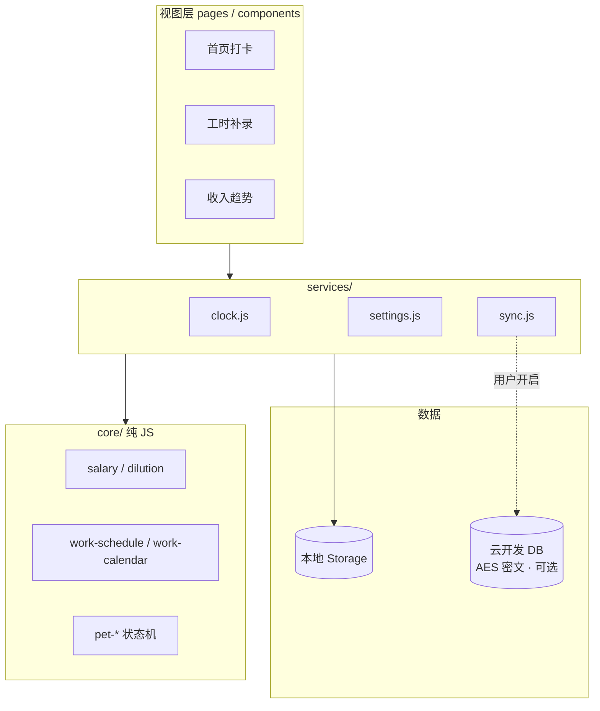

# 薪时宝 · XinShiBao

> 上班每一秒，都看得见「值多少钱」。

面向职场人的 **工时 · 时薪 · 收工仪式感** 微信小程序。设置月薪与工时后，首页实时刷新今日已赚金额；收工打卡、补录历史、周月趋势一应俱全。默认数据仅存本地，云备份可选且 AES 加密。

---

## 特性

- **实时时薪** — 上班后每秒更新今日收入，环形进度反映标准工时与加班稀释
- **一键收工** — 跨天未收工提醒、收工仪式感（金币雨 + 分享卡片）
- **工时档案** — 补录 / 修改历史记录，日历浏览，周 / 月收入趋势
- **灵活班制** — 双休 / 单休 / 大小周、法定节假日自动识别、调休与补班
- **五险一金** — 可配置社保公积金，到手时薪按净收入计算
- **陪伴小猫** — 首页精灵猫随工作状态变化（睡觉、伸懒腰、巡视…）
- **隐私优先** — 不采集昵称 / 手机号 / 位置；云备份默认关闭，开启后 AES 加密 + OpenID 隔离

---

## 技术栈

| 层级 | 说明 |
|------|------|
| 客户端 | 原生微信小程序（WXML / WXSS / JS） |
| 计算层 | 纯 JS，`miniprogram/core/` 零 `wx.*` 依赖，可 Node 单测 |
| 存储 | 本地 `wx.storage` 为主 |
| 云端 | 微信云开发（CloudBase）— 可选加密备份 + 节假日刷新 |
| 测试 | Node 原生测试 + miniprogram-automator E2E |

---

## 快速开始

### 环境要求

- [微信开发者工具](https://developers.weixin.qq.com/miniprogram/dev/devtools/download.html) Stable
- Node.js ≥ 18（跑测试与资源构建脚本）
- 微信云开发环境（**仅云备份 / 节假日刷新需要**）

### 本地运行

```bash
git clone <your-repo-url>
cd salary-record
npm install
```

1. 用微信开发者工具打开项目根目录（**小程序模式**，勿选「多端应用模式」）
2. 配置 AppID（二选一）：
   - 复制 `project.private.config.example.json` → `project.private.config.json`，填入你的 AppID
   - 或直接使用测试号 / 游客模式（`project.config.json` 默认为 `touristappid`）
3. 编译 → 扫码预览 / 真机调试

> 首次使用会进入引导页，填写月薪与工时后即可在首页开始「搬砖」。

---

## 项目结构

```
salary-record/
├── miniprogram/           # 小程序主体
│   ├── app.js             # 入口、云初始化
│   ├── core/              # 纯 JS 领域逻辑（薪资、工时、宠物状态机…）
│   ├── services/          # wx 适配层（clock、settings、sync、holidays）
│   ├── pages/             # 页面（home / onboarding / profile / settings / record / income）
│   ├── components/        # 组件（cat-pet、share-card、trend-chart…）
│   ├── assets/            # 图标、音效、精灵图、内置节假日
│   └── vendor/            # vendored crypto-js（云备份加密）
├── cloudfunctions/
│   ├── sync/              # 加密数据 pull / push
│   └── getHolidays/       # 节假日 CDN 代理
├── tests/                 # core / services 单测 + E2E
├── scripts/               # 精灵图切片、音效拷贝等构建脚本
└── project.config.json    # 微信项目配置
```

### 架构示意



---

## 云同步（可选）

不配置云开发也可完整使用；本地数据不受影响。

### 0. 绑定云环境

1. 开发者工具 → **云开发** → 创建 / 选择环境
2. 右键 **`cloudfunctions`** → **切换环境**
3. 将云环境 ID 写入本地配置（**勿提交 GitHub**）：
   - 复制 `miniprogram/envList.example.js` → `miniprogram/envList.local.js`
   - 填入你的 `envId`

### 1. 部署云函数

```bash
cd cloudfunctions/sync && npm install
cd ../getHolidays && npm install   # 可选，节假日云端刷新
```

开发者工具右键 **`cloudfunctions/sync`** → **上传并部署：云端安装依赖**（`getHolidays` 同理）。

或使用 CLI 脚本（Mac 默认路径，可通过环境变量覆盖）：

```bash
envId=你的环境ID ./uploadCloudFunction.sh
```

### 2. 数据库

云开发控制台新建集合 `user_settings`、`clock_records`，安全规则：

```json
{
  "read": "doc._openid == auth.openid",
  "write": "doc._openid == auth.openid"
}
```

### 3. 小程序内开启

**我 → 工作设置 → 云端备份** → 开启。数据 AES 加密后上传，仅本人可解密。

| 报错 | 处理 |
|------|------|
| 请在 cloudfunctionRoot 选择一个云环境 | 完成「绑定云环境」 |
| `FUNCTION_NOT_FOUND` / `-501000` | 重新上传并部署 `sync` 云函数 |
| `-502005` 集合不存在 | 创建上述集合并重部署 |

---

## 测试

```bash
# 核心单测（薪资、工时、宠物、同步等）
npm run test:core

# 宠物 E2E（需开发者工具 + automator）
npm run test:pet-e2e

# 全部
npm run test:all
```

资源构建（改精灵图 / 音效后）：

```bash
npm run build:cat-atlas
npm run build:meow-sfx
```

---

## 隐私与数据

| 数据 | 默认 | 说明 |
|------|------|------|
| 薪资 / 工时设置 | 仅本地 | 用户主动填写 |
| 打卡记录 | 仅本地 | 使用产生 |
| 微信 OpenID | 不采集 | 仅开启云备份时使用 |
| 相册 | 不读取 | 仅保存分享图时写入 |

不采集微信昵称、头像、手机号、地理位置。详见微信小程序后台「用户隐私保护指引」。

---

## 开发说明

- **`core/` 禁止直接调用 `wx.*`** — 便于单测与长期维护
- **`lazyCodeLoading: requiredComponents`** — 按需注入组件，控制主包体积
- **开发版调试** — 首页长按猫咪可打开动画调试面板（`develop` 环境；体验版 / 正式版不可见）
- **`project.private.config.json`** / **`miniprogram/envList.local.js`** — 本机 AppID 与云环境 ID，已加入 `.gitignore`

---

## 相关链接

- [微信小程序文档](https://developers.weixin.qq.com/miniprogram/dev/framework/)
- [微信云开发文档](https://developers.weixin.qq.com/miniprogram/dev/wxcloud/basis/getting-started.html)

---

## Star History

如果这个项目对你有帮助，欢迎 Star ⭐

<!-- 上线后可替换为 star-history 徽章 -->
<!-- [](https://star-history.com/#YOUR_USER/salary-record&Date) -->
